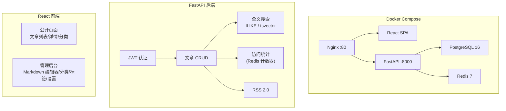

# 个人博客


全栈个人博客系统：FastAPI 后端 + React 前端 + PostgreSQL + Redis + Docker。

## 架构



## 技术栈

| 层 | 技术 |
|---|---|
| 后端 | FastAPI (Python 3.12) + SQLAlchemy 2.0 async |
| 数据库 | PostgreSQL 16 + Redis 7 |
| 搜索 | ILIKE + tsvector 全文搜索 |
| 认证 | JWT (access + refresh token rotation) |
| 前端 | React 19 + TypeScript 6 + Vite |
| UI | shadcn/ui + Tailwind CSS 4 |
| 状态管理 | TanStack Query v5 |
| 测试 | pytest + Playwright |
| CI/CD | GitHub Actions |
| 部署 | Docker Compose |

## 快速开始

```bash
# Docker 开发环境
cp .env.example .env
docker compose -f docker/docker-compose.yml up -d
docker compose -f docker/docker-compose.yml exec backend uv run alembic upgrade head

# 访问
# 前端: http://localhost:5173
# API 文档: http://localhost:8000/api/docs
```

```bash
# 本地开发
cd backend && uv sync && uv run uvicorn app.main:app --reload
cd frontend && npm install && npm run dev
```

## 项目结构

```
├── backend/app/          # FastAPI 后端
│   ├── core/             # 配置、JWT、数据库、Redis
│   ├── models/           # SQLAlchemy 模型
│   ├── schemas/          # Pydantic 验证
│   ├── routers/          # API 路由
│   ├── services/         # 业务逻辑
│   └── search/           # 搜索引擎
├── frontend/src/         # React 前端
│   ├── pages/            # 页面组件
│   ├── components/       # UI 组件 + shadcn
│   ├── hooks/            # React Query hooks
│   └── api/              # API 客户端
├── docker/               # Docker Compose
├── scripts/              # 数据迁移/基准测试
└── .github/workflows/    # CI/CD
```

## 功能

- 📝 Markdown 文章编辑与渲染
- 🏷️ 分类/标签体系
- 🔍 全文搜索（ILIKE + tsvector）
- 📡 RSS 2.0 订阅
- 📊 访问统计（Redis 计数器）
- 🐳 Docker 一键部署
- 🔐 JWT 认证 + Token 轮转
- ✅ 集成测试 + E2E 测试

## API 概要

| Method | Path | Auth |
|--------|------|------|
| POST | `/api/auth/login` | - |
| GET | `/api/posts` | - |
| GET | `/api/posts/{slug}` | - |
| POST | `/api/admin/posts` | JWT |
| GET | `/blog/rss.xml` | - |
| GET | `/api/stats/overview` | - |

完整文档: http://localhost:8000/api/docs

## License

MIT
